# booking-restaurant-project-4
# Restaurant Booking System
## Introduction

This is a Django-based web application that serves as a restaurant booking and menu management system. The platform allows customers to browse the restaurant menu, book tables, and view their bookings. Admins can manage the menu, view and manage bookings, and update the restaurant's operations. The booking system logic was inspired by the precedent project on code's institute course and blogs. This website was created as a learning exercise for my [Code Institute](https://codeinstitute.net/global/) fourth portfolio project.
The live app can be found [here](https://booking-restaurant-project-b216b1fa54b9.herokuapp.com/bookings/).

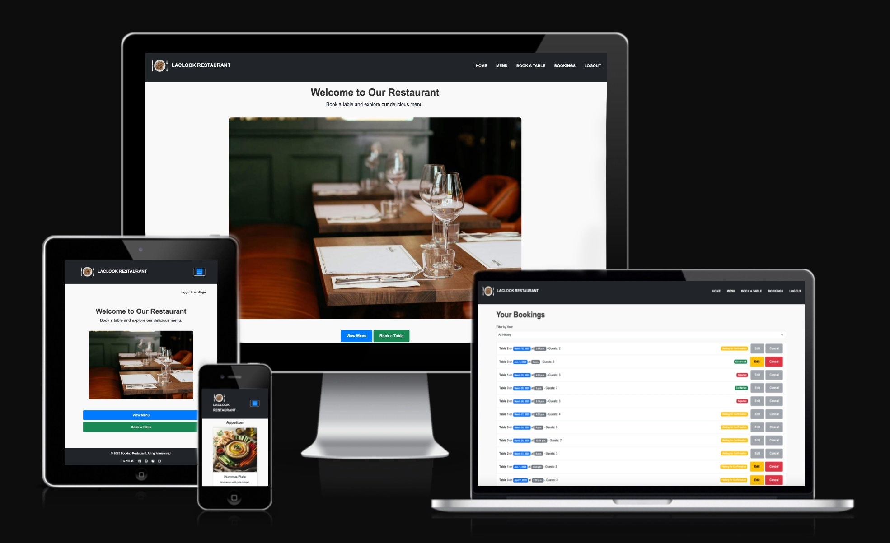

## Project Goals
- To create a website that is easy to navigate and use.
- To create a visually appealing website.
- To create a website that is responsive on all devices.
- To create an interactive website.
- To create a website that is fun to use.
- To create a website that is easy to use.

## User Stories
### Site Users
- As a user, I want to view the restaurant's menu.

- As a user, I want to make a reservation.

- As a user, I want to receive a confirmation of my booking.

### Site Admin
- As an admin, I want to manage reservations.

- As an admin, I want to add, update, or remove menu items.

- As an admin, I want to manage user bookings efficiently.

## Wireframe Explanation

This document outlines the wireframe design for our restaurant booking website, including both desktop and mobile views. The goal is to provide a clear and intuitive user experience for browsing the menu, making reservations, and accessing essential information.

### Desktop Wireframe

The desktop wireframe maintains a clean and organized layout, prioritizing key information and actions.

* **Header:**
    * Includes the restaurant logo, navigation menu (Home, Menu, Bookings), and a "Book" button for quick access.
* **Banner:**
    * Features a prominent image showcasing the restaurant's ambiance or signature dishes, along with a concise and appealing tagline.
* **Menu Section:**
    * Displays menu items with clear descriptions and pricing. Categories are used to organize the menu for easy navigation.
* **Reservations Section:**
    * Provides a user-friendly form for booking tables, including date, time, and number of guests selection.
* **Footer:**
    * Contains essential information such as contact details, social media links, and copyright information. 
* **Overall:**
    * The Desktop layout takes advantage of the larger screen size to display more content simultaneously, and to improve the navigation.
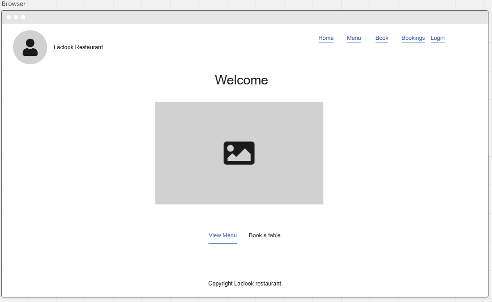
### Mobile Wireframe

The mobile wireframe focuses on a responsive and user-friendly experience on smaller screens.

* **Header:**
    * A simplified header with a navigation and a smaller responsive logo with the name of the restaurant "Laclook".
* **Main Content:**
    * Content is presented in a readable and easy navigating style. The image from the desktop version is adapted to work well on mobile.
* **Menu:**
    * Menu items are presented in a double or single, scrollable column to ensure readability and ease of navigation. The form from the desktop version is adapted to work well on mobile.
* **Bookings and bookings list:**
    * A reservation form with clear input fields. The bookings list allow filtering of results based on time.
* **Footer:**
    * Contact information are clear including social media links.
* **Overall:**
    * The mobile wireframe prioritizes clarity and simplicity, ensuring that all key features are easily accessible on smaller screens.
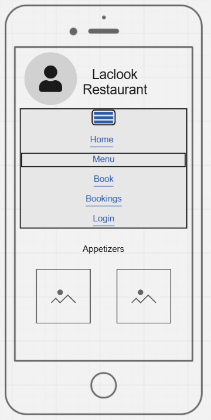

## Design
### Look and feel

With the design for this website, the aim was to create a fun and easy-to-use website. The main colours were chosen from black and white. Had to add some CSS text-shadow trickery to improve the contrast on the light background. 

### Typography
- [Google Fonts](https://fonts.google.com/) was used for the font.
Font-family 'Arial' was chosen for the site. This font was chosen because it is easy to read and looks good on all devices. By using this font the site is more accessible for people with visual impairments whilst. 
Fall back font is Sans-serif.

## Database Schemas
The database consists of three main models: Table, MenuItem, and Booking. 

The project uses a relational database with the following models:

- A User can have multiple bookings (One-to-Many).
- A Booking is assigned to one Table (Foreign Key).
- A Booking can include multiple MenuItems, creating a many-to-many relationship.
- Each Table has a fixed capacity, and a Booking must respect that capacity ensuring that the number of guests does not exceed capacity.

Below is the detailed schema representation:

## Database Schemas
The provided visualization, produced in https://dbdiagram.io/, defines the relationships between the users, tables, bookings, and menuitems models for a restaurant booking application. It establishes a one-to-many relationship between users and bookings, indicating that a single user can create multiple bookings. Similarly, a one-to-many relationship exists between tables and bookings, reflecting that a single table can be associated with multiple bookings. This is justified as a user makes many bookings, and a single table has many reservations over time. The menuitems table is independent, as it describes menu items without direct association to users or bookings.
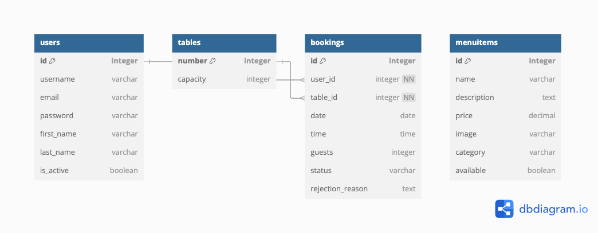

## Model Descriptions

### User Model - BookingAndMenu App

The User model represents the users who can register, log in, and make reservations.

| Key         | Field Type   | Validation                          |
|------------|------------|-----------------------------------|
| username   | CharField   | Unique=True, max_length=150       |
| email      | EmailField  | Unique=True                       |
| password   | CharField   | max_length=128                    |
| first_name | CharField   | max_length=30, blank=True         |
| last_name  | CharField   | max_length=30, blank=True         |
| is_active  | BooleanField | Default=True                       |

### Table Model - BookingAndMenu App

The Table model represents restaurant tables available for booking.

| Key      | Field Type   | Validation                |
| -------- | ------------ | ------------------------- |
| number   | IntegerField | Unique=True               |
| capacity | IntegerField | Must be greater than zero |

### Booking Model - BookingAndMenu App

The Booking model is used to store reservations made by users.

| Key              | Field Type   | Validation                                                |
| -----------------| ------------ | --------------------------------------------------------- |
| user             | ForeignKey   | User, on\_delete=models.CASCADE                           |
| table            | ForeignKey   | Table, on\_delete=models.CASCADE                          |
| date             | DateField    | Must be in the future                                     |
| time             | TimeField    | Required                                                  |
| guests           | IntegerField | Minimum=1, Maximum=table.capacity                         |
| status           | CharField    | Choices=(waiting, confirmed, rejected), Default='waiting' |
| rejection_reason | TextField    | No restrictions                                           |

### MenuItem Model - BookingAndMenu App

The MenuItem model stores menu items available for ordering.

| Key         | Field Type   | Validation                                           |
| ----------- | ------------ | ---------------------------------------------------- |
| name        | CharField    | max\_length=100                                      |
| description | TextField    | No restrictions                                      |
| price       | DecimalField | max\_digits=6, decimal\_places=2                     |
| image       | ImageField   | upload\_to='menu\_images/', blank=True, null=True    |
| category    | CharField    | Choices=(appetizer, main\_course, dessert, beverage) |
| available   | BooleanField | Default=True                                         |

##

## Features
### Existing Features 
### User Features:
- **Navigation Bar**
  - Featured on all five pages, the full responsive navigation bar includes links to the Home page, Menu, Book a Table, Bookings of the User and Log Out page and is identical in each page to allow for easy navigation.
  - This section will allow the user to easily navigate from page to page across all devices without having to revert back to the previous page via the ´back´ button.
  

- **Home Page**
  - The Home page displays a welcoming introduction to the restaurant with an image to the restaurant and contain two buttons to the viewing menu or booking a table. 
  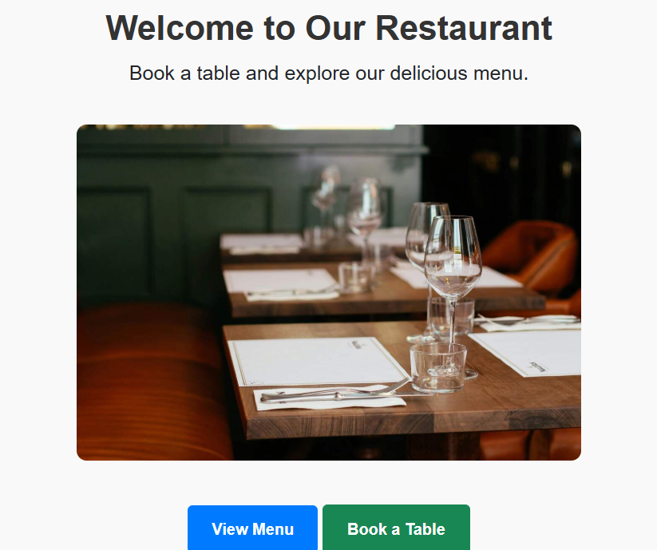

- **The Footer**
  - The footer section includes links to the relevant social media sites for Laclouc Restaurant. The links will open to a new tab to allow easy navigation for the user.
  - The footer is valuable to the user as it encourages them to keep connected via social media.
  

- **Menu Page**
  - The Menu page allows users to browse menu items categorized by type.
  - Displays images, descriptions, and prices for each dish.
  - Users can filter menu items by category (e.g., appetizers, main dish, desserts, beverage).
  - Admins can add, update, and remove menu items.
   
   In conclusion, The customers can browse the restaurant's menu, including details such as dish names, descriptions, prices, and images of the dishes.
   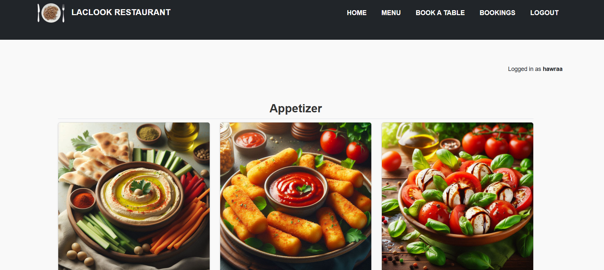

- **Reservation System in a Book a Table Page**
  - Users can select a date, time, and number of guests for their booking.
  - The system ensures that the selected date is in the future.
  - A waiting of confirmation email is sent upon successful booking.
  - Users can modify or cancel their reservations.
  - The system checks table capacity to ensure it matches the number of guests.
  - Admins have access to a dashboard to manage all reservations.
  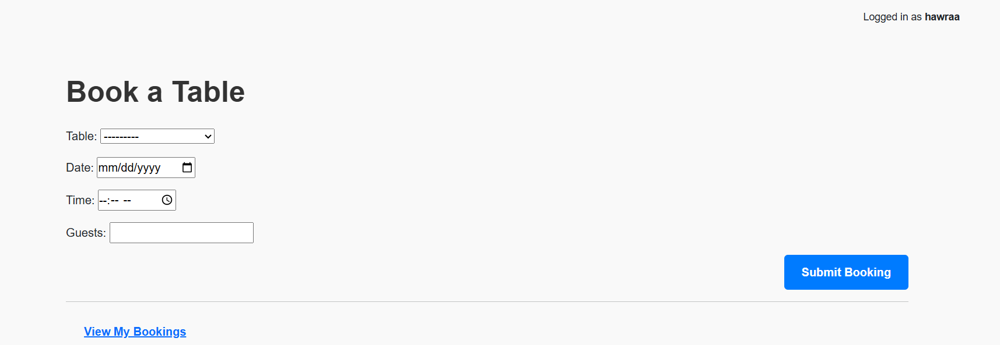

- **Bookings Page**
  - Users can view their current and past bookings.
  - Users can update or cancel their reservations.
  - Displays reservation details including table, date, time, number of guests, and status.
  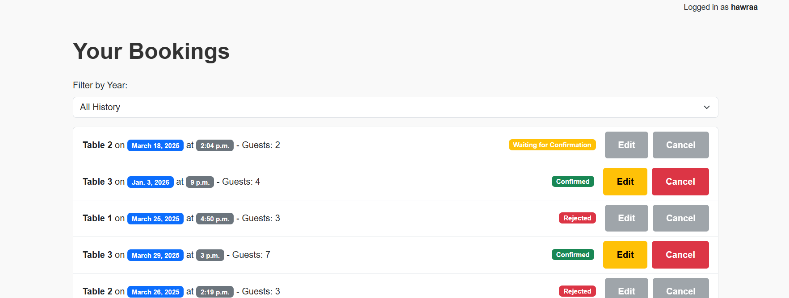

- **Admin Dashboard**
  - Admin Dashboard: Enables restaurant staff to manage bookings and update menu items.
  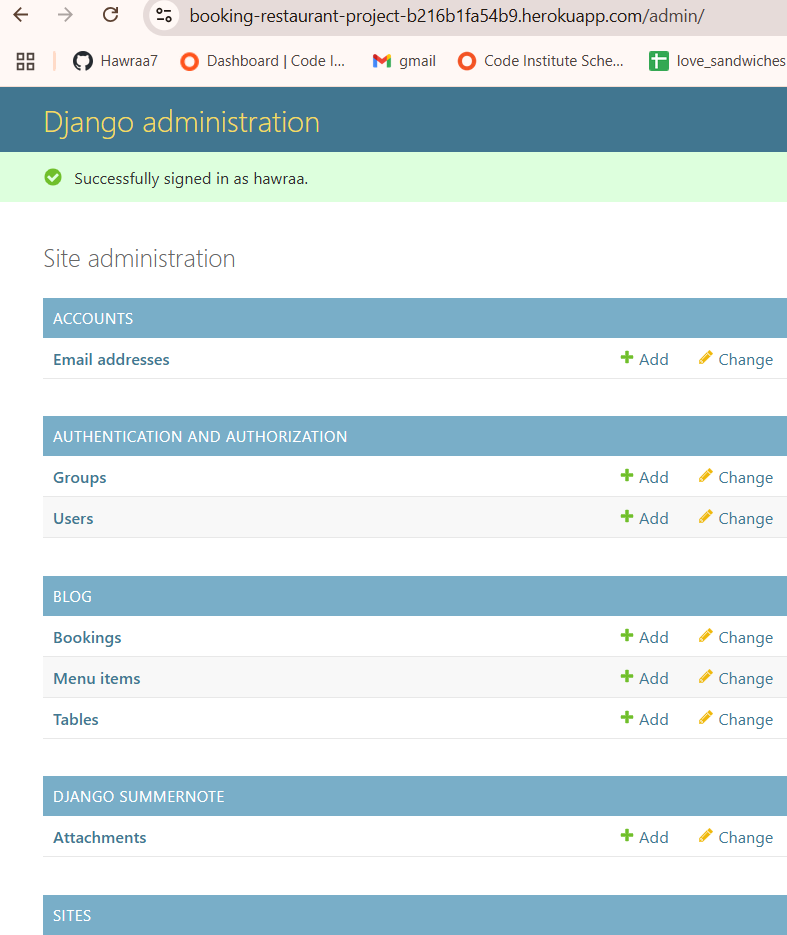

### Admin Features:
- **Manage Menu Items**
  - Admins can add, update, or remove dishes from the menu.
  - Admins can upload images and set descriptions and prices.

- **Manage Bookings**
   - Admins have the ability to view all bookings made by users, update booking status (e.g., confirmed, pending, canceled), and even cancel or reschedule bookings.

- **User Management** 
  - Admins can manage user accounts, which includes viewing their information and associated bookings. This ensures that the admin can keep track of users' activity on the platform.

- **Logout/ Login/ Register Pages**
  - The logout page allows users to securely log out of their account after they've finished interacting with the website.
  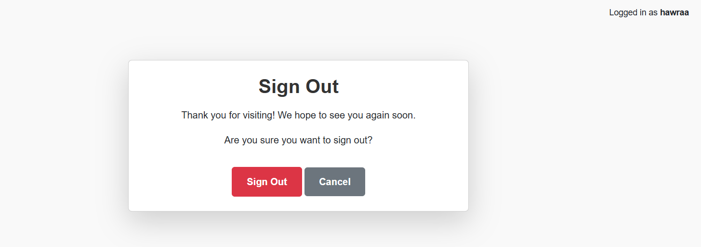
  - Once logged out, users are redirected to the Home Page including Login or Register page, depending on the authentication flow.
  - The user session is cleared, ensuring their data is no longer accessible after log out.
  - The Login page allows returning users to log into their accounts.The users must enter their username/email and password to access their account. Upon successful login, the users are redirected to the homepage or the last visited page.
  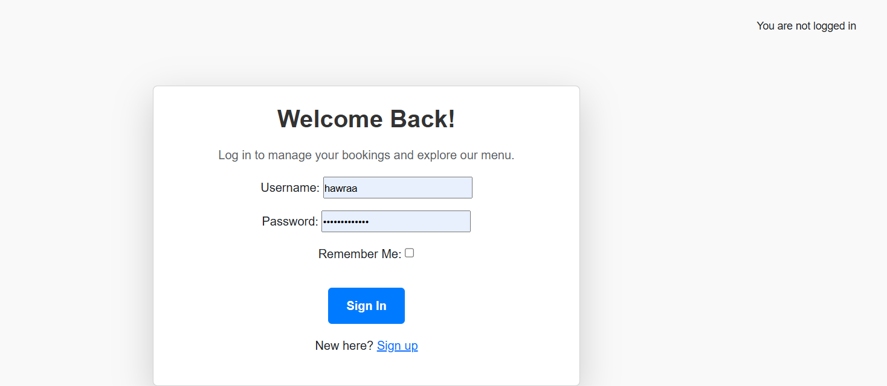
  - The Register Page allows new users to create an account by providing their details, so they can make reservations, view their booking history, and more. The users must provide a unique username/email and a password. After registration, users are automatically logged in and redirected to the homepage or their dashboard.
  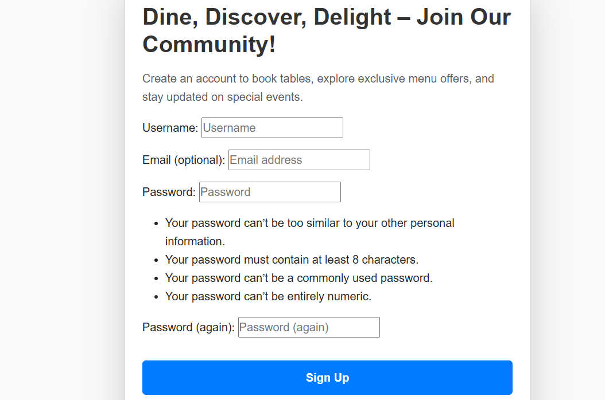
  This feature enhances the security and privacy of the users by ensuring that they can exit their session whenever they choose, and gives them the option to log back in or create a new account.
  

### Future Features
  - Online Payment Integration: Allow users to pay for reservations online.
  - Reviews & Ratings: Allow customers to leave feedback on menu items.
  - Special Offers & Discounts: Promote seasonal deals and discounts.

### Technologies Used

 #### Languages
   - Python as the backend programming language.
   - HTML as the markup language and templating language.
   - CSS as the style sheet language.
   - JavaScript to create carousel on index.html.

 #### Frameworks & Libraries
   - Django as the Python web framework.
   - Bootstrap as the CSS framework.
   - PostgreSQL
   - jQuery to simplify DOM manipulation.

 #### Django Packages
  
    Django installs a few packages by default and some packages get installed with other packages. Will list out the ones that I installed.

    1. crispy bootstrap : django-crispy-bootstrap5 provides you with a crispy-forms template pack to use with django-crispy-forms in your Django projects.
    2. Django: Django is a high-level Python Web framework that encourages rapid development and clean, pragmatic design.
    3. Django-allauth: integrated set of Django applications addressing authentication, registration, account management as well as 3rd party (social) account authentication.
    4. Django-storages : Django Storages is a collection of custom storage backends for Django.
    5. Pillow: PIL is the Python Imaging Library.
    6. Psycopg2: Psycopg is the most popular PostgreSQL database adapter for the Python programming language. Its main features are the complete implementation of the Python DB API 2.0 specification and thread safety (several threads can share the same connection). It was designed for heavily multi-threaded applications that create and destroy lots of cursors and make a large number of concurrent “INSERT”s or “UPDATE”s.
    7. whitenoise:  With a couple of lines of config WhiteNoise allows your web app to serve its own static files, making it a self-contained unit that can be deployed anywhere. 

#### Other tools and programs

- Food images used in the menu page were sourced from [Pexels](https://www.pexels.com/), which provide free high-quality images. Some images were also generated using AI tools like [Chatgpt](https://chatgpt.com/), [Gemini](https://gemini.google.com/), and [Copilot](https://copilot.microsoft.com).
- Icons used in the project were taken from [Font Awesome](https://fontawesome.com/).
- [ami.responsivedesign.is](https://ui.dev/amiresponsive) was used to create the mockup image.
- [Visual Studio Code](https://code.visualstudio.com/) did all of my coding and synchronizing with GitHub on VS Code.
- [GitHub](https://github.com/) : for hosting repositories.
- [Heroku](https://www.heroku.com/) where the website is deployed.

  

## Testing

Each feature of the application was manually tested to ensure that it works as intended. The following actions were performed:

- Navigation Links: Checked that all navigation links work correctly and direct the user to the appropriate page.

- Menu Display: Verified that all menu items are displayed properly with images, descriptions, and prices.

- Booking System: Ensured that users can select a date, time, and number of guests, and that the system correctly validates and confirms reservations.

- Booking Modification: Tested the ability to edit and cancel reservations.

- Admin Features: Confirmed that the admin can manage bookings, add/update/delete menu items, and oversee reservation schedules.

- User Authentication: Verified that users can register, log in, and log out securely.
### Code Validation and performance testing
#### Google Lighthouse Validation
All pages were tested with Google Chrome Lighthouse. Testing was performed in private browsing mode and on the live website on Heroku.

#### Page Testing Results
| Page                 | Image |
|----------------------|-------|
| Home Page           | Google Lighthouse |
| Menu Page           | Google Lighthouse |
| Booking Page        | Google Lighthouse |
| Booking List Page   | Google Lighthouse |
| Login Page          | Google Lighthouse |
| Logout Page         | Google Lighthouse |
| Register Page       | Google Lighthouse |

#### CSS Validation
No errors were found when passing through the official W3C validator.

#### HTML Validation
All pages were passed through the official W3C validator.
Validating was done by a live website on Heroku. Some errors were found but they are all related to Django templates.

| Page                 | Image |
|----------------------|-------|
| Home Page           | HTML Validator |
| Menu Page           | HTML Validator |
| Booking Page        | HTML Validator |
| Booking List Page   | HTML Validator |
| Login Page          | HTML Validator |
| Logout Page         | HTML Validator |
| Register Page       | HTML Validator |

#### JavaScript Validation
All JavaScript files were passed through the official JSHint validator.

| File                | Image |
|----------------------|-------|
| script.js (Bootstrap carousel on home page) | JSHint Validator |

#### PEP8 Code Institute Python Linter Validation
All Python files were passed through the Code Institute PEP8 validator.

##### Project App Validation Results
| File         | Result |
|-------------|--------|
| settings.py | PEP8 Linter |
| urls.py     | All clear, no errors found |

##### Booking App Validation Results
| File       | Result |
|-----------|--------|
| admin.py  | All clear, no errors found |
| apps.py   | All clear, no errors found |
| forms.py  | All clear, no errors found |
| models.py | All clear, no errors found |
| urls.py   | All clear, no errors found |
| views.py  | All clear, no errors found |

##### Users App Validation Results
| File       | Result |
|-----------|--------|
| admin.py  | All clear, no errors found |
| apps.py   | All clear, no errors found |
| forms.py  | All clear, no errors found |
| models.py | All clear, no errors found |
| urls.py   | All clear, no errors found |
| views.py  | All clear, no errors found |

### Automated Testing

Django unit tests were written for key functionalities, including:

- Models: Tested relationships and constraints such as ensuring a booking cannot be made for a past date.

- Views: Checked that all views return the correct HTTP responses and templates.

- Forms: Validated form submission, including error handling and required fields.

- Authentication: Ensured that unauthorized users cannot access restricted pages.

To run automated tests:
- python manage.py test
(screenshot lal tests............................................................)
### Cross-Browser Testing

The website was tested on the following browsers:

- Google Chrome
- Mozilla Firefox
- Microsoft Edge
- Safari

All features functioned as expected across different browsers.

### Responsive Design Testing

The site was tested on multiple screen sizes to ensure it is fully responsive:

- Desktop (1920x1080)
- Laptop (1366x768)
- Tablet (768x1024)
- Mobile (375x667)
Results:

- Navigation and layout adjusted dynamically.
- The reservation system remained accessible and easy to use.
- Images and text resized correctly without breaking layouts.

### Validator Testing
- HTML
  - No errors were returned when passing through the official [W3C validator](https://validator.w3.org/).
- CSS
  - No errors found via the official [W3C (Jigsaw) validator](https://jigsaw.w3.org/css-validator/).
- Python
  -  Code quality checked with flake8 for [PEP8 compliance](https://pep8ci.herokuapp.com/).

### Unfixed Bugs
  - No known unfixed bugs were found during testing. All identified issues were addressed to ensure smooth functionality across different devices, browsers, and user scenarios. The system has been thoroughly tested for usability, performance, and responsiveness.

## Deployment 
The site was deployed to GitHub pages. The steps to deploy are as follows:
- Ensure dependencies are up to date by running: 
  - pip freeze > requirements.txt
- Create a Procfile in the root directory with the following content:
  - web: gunicorn bookingrestaurant.wsgi
- Create a new Heroku app
- Set environment variables in Heroku:
  - set DEBUG=False
  - heroku config-var:
    - set SECRET_KEY= my_secret_key
  - heroku config-var:
    - set DATABASE_URL= my_database_url
- Run database migrations on Heroku
- Push the project to Heroku
- Manual deploy in heroku

- Open App or click View when you see: Your app was successfully deployed.
Once the deployment process is completed, the application will be live on Heroku and accessible through the provided URL: (https://booking-restaurant-project-b216b1fa54b9.herokuapp.com/bookings/)

## Content

- All written content in the project was created by Me.
- Some UI/UX ideas were inspired by popular restaurant websites, and the booking system logic was inspired by the precedent project on Code's Institute course and blogs.
- [Django documentation](https://docs.djangoproject.com/en/5.1/) was used as a reference for implementing models and views.
- The deployment steps were adapted from the official Heroku documentation (Heroku Docs).

## Credits
 
I would like to say thanks to all for the support throughout the project.
- Code Institute for all the support and knowledge.
- Slack community tech-humour channel where I got the inspiration for this project and some feedback. My cohort channel for all the support and feedback.
- My mentor Diego Pupato who's continuously very supportive of me and very knowledgeable.
- I would also like to thank or say sorry to my family. I'm not too sure they have seen me much these past weeks.

  

